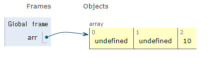

# Array
Array, 즉 배열은 프로그래밍을 하는데 있어서 매우 흔히 사용되는 자료구조 입니다. 

Array는 보통 어떤 데이터를 연속적으로 저장하기 위해서 흔히 사용되기 때문에 많은 언어에서 내장된(Built-in) 형태로 제공합니다. 그래서 배열을 따로 구현하려고 할 필요가 없습니다.


# JS에서 Array
일반적으로 익숙한 고급 언어들(C언어, C++, JAVA)은 전부 Array를 지원합니다. 보통 [] 로 표현 합니다. 하지만 언어마다 다른 특성이 있습니다.

정적인 언어들, 특히 C언어 같은 오래된 언어의 경우 컴파일 단계에서 Array의 크기, 형태, 값이 미리 결정되어 있어야 합니다.


**Unmanaged language** 인 대다수의 객체지향 언어의 경우는 Array는 객체로 제공합니다. 
```
arr = new Array();
```

객체로 제공하기 때문에 Array를 선언 
```
Javascript
ex)
var arr = [];
arr[2] = 10;

console.log(arr)
```


```
Python
ex)
array = []
array.append(10)

print(array)
```


# 2차원 배열

```
2차원 Array 선언 : [ [ ] ]
```

이 2차원 배열을 하는 하는 이유 query를 요청해서 반환하는 데이터가 이차원 배열로 반환됩니다.
```
var twoD = [[]];
```
위는 [] 키워드를 사용하여 간단하게 만드는 예입니다. 생성자를 사용하는 경우는 아래와 같습니다.

```
var twoD = new Array(5);
for(var i = 0; i < twoD.length; i++) { twoD[i] = new Array(5); }
```

배열에 접근(Access) 하는 법과 배열에 값을 쓰는 법 : [ i ]
배열에 접근할 때는 [] 라는 연산자(operator)을 사용합니다. 예를 들어 100개의 공간을 가지는 배열에 1,2,3,4,…..,100을 집어넣으려면 다음과 같습니다.

```
var nums = [];
for(var i = 0; i < 100; i++) {
    nums[i] = i+1;
}
```
```
var nums = [1,2,3];
var sum = nums[0] + nums[1] + nums[2];
```

위 코드에서 [i]를 통해 인덱스에 해당하는 값에 접근하고 있습니다. 하나의 배열에서 특정 인덱스만 접근하는 예는 아래와 같습니다.

```
var arr = [
    [1],
    [2],
    [3],
    [4],
    [5],
    [6],
]

console.log(arr[3][0]);

4
```


```
Node.js
ex ) 구현했던 node.js 코드 예제)
var queryString = 'select * from post';
getConnection().query(queryString, function(err, data){
    console.log(data);
    // 여기서 data 데이터베이스에 쿼리를 실행하는 결과가 아래의 예시와 같이 2차원 배열의 비슷한 형태의 객체로 반환됩니다.
});

```

```
DataBase queryset return Value
[
    {
        "id":1,
        "title": "sdklfjasdklf",
        "content": "sdklfjasdklf",
        "create_date": "sdklfjasdklf",
        "status": 0,
    },
        {
        "id":2,
        "title": "sdklfjasdklf",
        "content": "sdklfjasdklf",
        "create_date": "sdklfjasdklf",
        "status": 0,
    },
        {
        "id":3,
        "title": "sdklfjasdklf",
        "content": "sdklfjasdklf",
        "create_date": "sdklfjasdklf",
        "status": 0,
    },
        {
        "id":4,
        "title": "sdklfjasdklf",
        "content": "sdklfjasdklf",
        "create_date": "sdklfjasdklf",
        "status": 0,
    },
        {
        "id":5,
        "title": "sdklfjasdklf",
        "content": "sdklfjasdklf",
        "create_date": "sdklfjasdklf",
        "status": 0,
    },
]
```