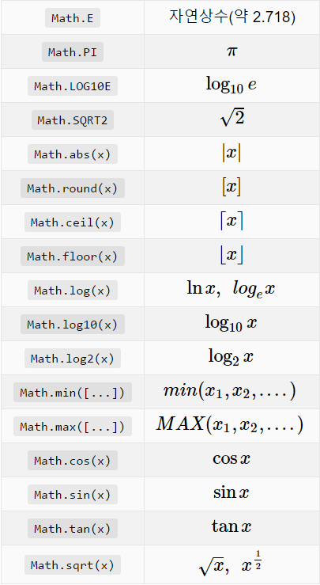
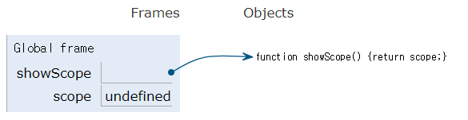
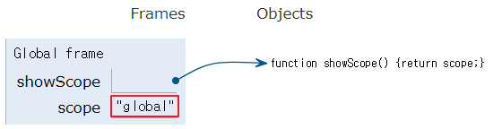
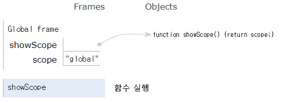
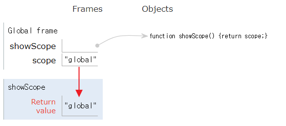

# 前선언 後 초기화.
**JS**의 변수는 기본적으로 **전역변수**(global variable; 프로그램이 시작될때 부터 종료시 까지 살아있는 변수)이고, 엄밀하게 말해서 일반적인 C언어나 Java와 같이 사용하기전에 꼭 선언을 해줘야 할 필요는 없습니다. JS에서 변수가 선언 없이 초기화 (Initialized)되면, 바로 전역 변수가 됩니다.

```
var Page = 5 //글로벌 변수 ( 전역 변수 )
function algo(){
    var page_num = 16;  // 지역 변수
    console.log(Page);
    console.log(page_num);

}
```

하지만, C++과 Java와 같은 컴파일 언어(Compiled Language)의 전통적인 관례인 전 선언 후 **초기화**를 하기로 되어 있습니다. 이런 전 선언 후 초기화는 전역변수의 무분별한 사용을 줄이고, 되도록이면 지역 변수를 최대한으로 사용할 수 있습니다. 이 부분은 후에 **Scope 개념**을 통해 짚고 나가기로 하겠습니다.

JS에서 변수의 선언은 **var** 이라는 키워드를 통해 변수임을 명시하고, 더해서 **배정문**(assignment)을 사용할 수 있습니다.

산술 연산(Arithmetic)과 Math 라이브러리 함수
JS에서 기본으로 사용할 수 있는 표준 산술 연산은 다음과 같습니다. 이항연산자 이고, 두개의 변수나 숫자가 필요합니다.

* X+Y : 더하기
* X-Y : 빼기
* X*Y : 곱셈
* X/Y : 나눗셈
* X%Y : 모듈러 연산 (일반적으로 나머지 연산이라고 한다.)


또, JS는 기본 산순연산자 외에, ``` Math ``` 라이브러리를 통해 삼각함수, 정수론, 로그 등의 심화 연산이 가능합니다.



## 조건문
익히 알다 시피, 조건문은 4가지가 존재합니다.

* if(조건) {...}
* if(조건) {...} else {...}
* if(조건) {...} else if(조건) {...} else {...}
* switch(변수명) { case 값1 : .... ; case ....}

## 반복문

익히 알다시피, 반복문은 다음과 같은 구문으로 존재합니다.

* while(반복이 수행 되는 조건){....}
* do{처음에는 반드시 실행되는 구문}while(반복이 수행되는 조건);
* for(반복에 사용되는 조건 변수 초기화; 반복 조건; 조건 변수 증감) {...}
* for 반복문의 경우에는 Array의 인덱스를 통해 접근 할때, 매우 효과적입니다.


또한 반복이 수행되는 조건이 true 이거나 for(;;;) 인 경우, 구문 중간에 멈추는 부분(break point)가 없다면 무한 루프를 돌게 됩니다. 따라서 무한 루프는 주의해서 사용해야 합니다.


## 함수

JS에서는 두가지의 함수로 보통 나뉘어 집니다.

 바로 ▲ 값을 반환하는 함수 ▲값을 반환하지 않는 함수 입니다. 값을 반환하지 않는 함수는 보통 subprocedure 또는 void function 이라고 부릅니다.

보통 컴파일 언어에서는 반환형을 다음과 같이 작성하는 경우가 많습니다.

```
//int 값을 반환하는 경우
int value_returning(int input){
    //...
    return output;
}
//반환하지 않는 경우
void subprocedure (int input) {
    //...
}
```


## 변수의 스코프(Scope)
스코프는 사전적으로 “영역”을 의미합니다. 보통 JS에서 스코프는 변수가 엑세스 할 수 있는 범위 를 의미합니다.

그리고 보통 이런 스코프의 개념은 함수에서 드러나기 때문에 함수 스코프(Function Scope) 라고 합니다. 함수 스코프의 경우에는 변수의 값은 함수 안에서 변수가 선언되고 정의 될 때, 그 안에서만 값이 보입니다.

또, 전역 스코프(Global Scope) 가 있습니다. 전역 스코프의 예시는 아래에서 확인해 볼 수 있습니다.

```
function showScope() {
    return scope;
}
var scope = "global";
console.log(scope); // "global"
console.log(showScope()); // "global"
```

위의 예시에서 보면 첫번째 scope 변수는 함수 안에서 scope가 선언도 되지 않고, 사용되고 있지만 showScope() 의 값이 “global” 가 됩니다. 그 이유는 var scope = "global" 이 함수 바깥에서 선언되어 전역변수의 기능을 하기 때문입니다. 따라서 함수는 이 전역변수의 값을 출력합니다.



전역 frame 에서 



전역 변수가 초기화 된다. 그후 전역 변수의 값이 출력된다.




showScope 함수가 실행된다.




반환 값이 자동적으로 전역변수를 따라간다.

참고 : http://www.pythontutor.com/visualize.html


```
function showScope() {
    var scope = "local"    
    return scope;
}
var scope = "global";
console.log(scope); // "global"
console.log(showScope()); // "local"
```


## 객체와 객체지향 프로그래밍(Object-Oriented Programming)
자료구조를 논할 때에는 보통 객체를 사용해서 논할 겁니다.

JS는 객체를 만드는데 많은 방법이 있습니다. 대표적으로 **생성자**를 통해서 객체를 만드는 방법입니다.

```
function Checking(amount) {   
    this.balance = amount; // 속성   
    this.deposit = deposit; // 메소드(함수)   
    this.withdraw = withdraw; // 메소드(함수)   
    this.toString = toString; // 메소드(함수)
}
```


여기서 Checking (예금 계좌) 이라는 객체를 만들었고, 생성자를 통해서 this 키워드를 통해 balance 라는 객체의 속성에 값을 할당 받을 수 있습니다. 그리고 Checking 계좌에는 deposit() , withdraw() , toString() 이라는 메소드를 통해 계좌를 관리하거나, 계좌 정보를 출력할 수 있습니다.

각각의 메소드의 경우 생성자 바깥에서 다시 구현 하면 됩니다.


```
function deposit(amount) { //입금
    this.balance += amount; 
}
function withdraw(amount) { //출금
    if (amount <= this.balance) { //잔액 여유 시
        this.balance -= amount;   
    }   
    if (amount > this.balance) { //잔액 부족 시
        print("잔액 부족");   
    } 
}
function toString() { //잔고 표시
    return "잔고: " + this.balance; 
}
```